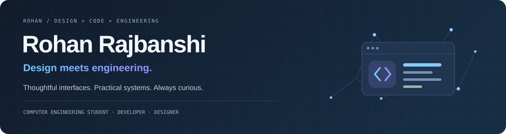
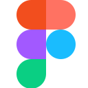

  

  <a href="https://myportfolio-flame-ten-69.vercel.app/">Portfolio ↗</a> &nbsp; · &nbsp;
  <a href="https://www.linkedin.com/in/rohan-rajbanshi-773882386/">LinkedIn ↗</a> &nbsp; · &nbsp;
  <a href="https://leetcode.com/u/lover3123/">LeetCode ↗</a> &nbsp; · &nbsp;
  <a href="mailto:userchat12@gmail.com">Say hello ↗</a>

### A little about me 

I’m **Rohan**, a Computer Engineering student at **Nitte Meenakshi Institute of Technology, Bengaluru**. I enjoy the space where design decisions become working interfaces and engineering ideas become useful projects.

I’m curious, persistent, and particular about the details. I like asking questions, experimenting, and refining a solution until it feels clearer and works better.

**01 / Building** — Web interfaces and practical projects, with attention to usability and visual detail. 
**02 / Learning** — Computer engineering, development practices, and reliable systems. 
**03 / Exploring** — Open source, AI/ML, and ways to connect thoughtful design with useful software.

**Interfaces should make things easier.** As a **UI Designer at Diseño Divino**, I work on student-led interfaces and visual systems at NMIT. My **EV Car prototype** explores an electric vehicle interface and user flows in Figma.

`UI/UX` · `Figma` · `Interactive prototyping` 
[Explore the prototype ↗](https://myportfolio-flame-ten-69.vercel.app/work/ev-car-prototype) · [Behance ↗](https://www.behance.net/userchat)

### Tools in my toolkit

   &nbsp;
   &nbsp;
   &nbsp;
   &nbsp;
   &nbsp;
   &nbsp;
   &nbsp;
   &nbsp;
   &nbsp;
   &nbsp;
   &nbsp;
  

**Interfaces & design:** React, HTML, CSS, JavaScript, TypeScript, Vite, Figma 
**Programming & systems:** Python, C++, Java, Node.js, MongoDB

These are tools I use or study, rather than proficiency scores. [See my skills and project evidence →](https://myportfolio-flame-ten-69.vercel.app/skills)

### Learning in public

- **GirlScript Summer of Code 2026:** open-source contributor; participation completed on **30 September 2026**.
- **Problem solving:** practicing algorithms and data structures on [LeetCode](https://leetcode.com/u/lover3123/).
- **Engineering activity:** [GitHub and LeetCode snapshots, with source labels and live data →](https://myportfolio-flame-ten-69.vercel.app/activity)

  
<b>How I like to work</b>

   
  <ul>
    <li>Understand the problem before choosing the tools.</li>
    <li>Make the interface clear, then refine the details.</li>
    <li>Build, test, learn, and improve through iteration.</li>
    <li>Be honest about what’s finished and what I’m still learning.</li>
  </ul>

---

<b>Let’s build something useful.</b> Open to internships, UI/UX and frontend opportunities, and thoughtful collaborations.

<a href="mailto:userchat12@gmail.com">Email me</a> &nbsp; · &nbsp; <a href="https://www.linkedin.com/in/rohan-rajbanshi-773882386/">Connect on LinkedIn</a> &nbsp; · &nbsp; <a href="https://myportfolio-flame-ten-69.vercel.app/">Visit my portfolio</a>

<!-- Original banner and companion artwork. Technology marks: Devicon; license in assets/tech/DEVICON-LICENSE.txt. -->
